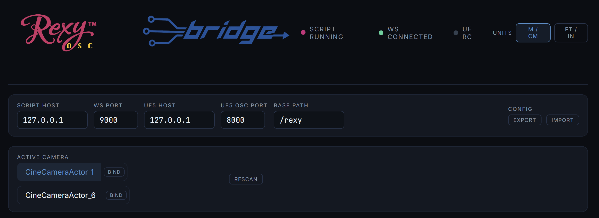
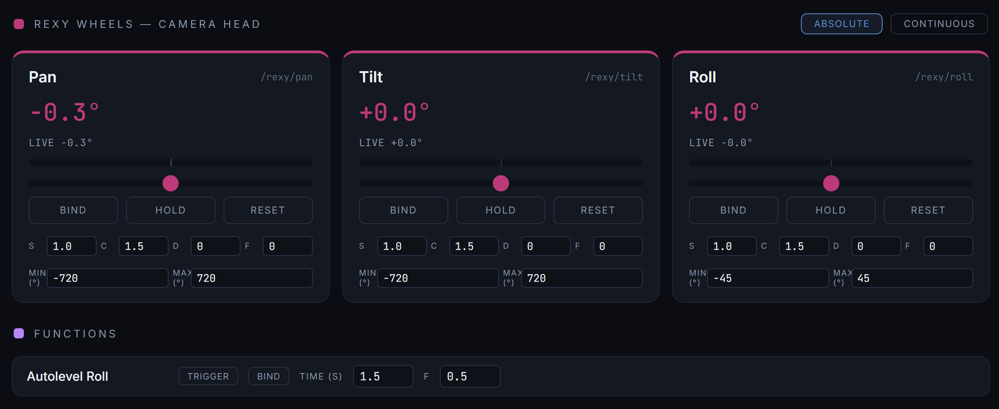

# Rexy Bridge

Virtual production camera control for Unreal Engine 5. Drive Cine Camera Actors and CameraRig_Crane rigs live in the editor using physical wheels, game controllers, or keyboard.



> ### v2.0 beta is here — Virtual MoCo
>
> The **`v2-beta`** branch adds a full **Virtual Motion Control** system: record live performances of every bound parameter at 60Hz, multi-take management, a colour-coded timeline with playhead and zoom, bezier-lite curve editing per track, and `.rxmove` file save/load. The bridge and hardware support are unchanged from v1.0 — everything new lives in the browser app.
>
> See the [v2.0.0-beta.1 release](https://github.com/RexyGaming/rexy-bridge/releases/tag/v2.0.0-beta.1) for the download, or `git checkout v2-beta` if you're cloning. Stable v1.0 stays on `main`. Bug reports welcome via Issues — please tag with `v2-beta`.

## What it does

- **Live camera head control** — pan, tilt, roll with a real fluid-head feel (response curve, sensitivity, deadband, feather per axis)
- **Crane rig control** — yaw, pitch, scope (arm length), and base X/Y/Z position
- **Drone / dolly modes** — velocity-based free-fly, or absolute positioning, switchable at runtime
- **Continuous wheels mode** — pan/tilt/roll as infinite-rotation velocity controls (fluid-head style)
- **Per-camera bindings** — each camera in your scene keeps its own input bindings; switch cameras with a button press
- **Custom lenses** — define focal range, aperture, focus distance; UE camera's LensSettings update live (focus goes to infinity)
- **Multiple inputs** — Rexy Wheels, PS4/Xbox controllers, keyboard, all bindable side-by-side
- **Autolevel function** — bindable button that smoothly returns roll to 0° over a configurable time
- **Live readouts** — see the camera's actual rotation/position alongside what your input is commanding
- **Imperial / metric units** — switch globally, plus a separate toggle for focus distance (focus pullers traditionally use ft/in)
- **Auto-invert on bind** — push the stick in the direction you want to be "positive" first; binding figures out the inversion automatically
- **Stick drift calibration** — 5-second null-drift capture nulls residual offsets from worn sticks



## Hardware support

| Device | Status |
|---|---|
| Rexy Wheels | Primary supported hardware |
| PS4 controller | Supported (sticks need null-drift calibration after movement) |
| Xbox controller | Should work (untested) |
| Keyboard | Supported |
| Generic HID gamepads | Supported via browser Gamepad API |

## Requirements

- **Python 3.9+**
- **Unreal Engine 5.3+** with the Remote Control plugin enabled
- A modern browser — Chrome / Edge / Firefox recommended (Safari Gamepad API support is partial)

## Quick start

### 1. Install Python dependencies

**Windows:**
```powershell
pip install -r requirements.txt
```

**Mac / Linux** (macOS Homebrew Python is externally managed — use a virtual environment):
```bash
python3 -m venv venv
source venv/bin/activate
pip install -r requirements.txt
```

### 2. Set up Unreal Engine

See [`docs/ue5-setup.md`](docs/ue5-setup.md) for step-by-step instructions covering:
- Enabling the Remote Control plugin
- Creating the `RexyControl` preset
- Exposing camera properties so multi-camera discovery works
- Finding your camera and crane object paths

### 3. Configure mappings

```bash
cp mappings.json.example bridge/mappings.json
```

Edit `bridge/mappings.json` and replace the `<YOUR_LEVEL>` / `<YOUR_CAMERA>` / `<YOUR_CRANE>` placeholders with the actual paths from your UE5 project. The UE5 setup guide walks you through finding these.

> **Note:** `mappings.json` must live in the `bridge/` subfolder, not the repo root.

### 4. Run the bridge

**Windows:**
```powershell
cd bridge
python rexy_osc.py --verbose
```

**Mac / Linux (with venv):**
```bash
./venv/bin/python3 bridge/rexy_osc.py --verbose
```

Or if your venv is active:
```bash
python3 bridge/rexy_osc.py --verbose
```

### 5. Open the app

Open `app/index.html` in your browser. It auto-connects to the bridge at `ws://127.0.0.1:9000`. When everything is up you'll see three indicators in the top right:

- **SCRIPT RUNNING** — pink/active
- **WS CONNECTED** — green
- **UE RC** — green (may take a moment to update; if grey but camera sliders move UE, the connection is working)

### 6. Bind your hardware

- Click **Bind** on any parameter card.
- For axis bindings (wheels/sticks), push in the direction you want to be "positive" *first* — the binding auto-inverts to match.
- For keyboard, press the increase key, then the decrease key.

> **Controller not showing up?** Click anywhere on the page first, then **press a physical button** on your device. The browser Gamepad API requires both a user gesture (click) and a button press before it detects controllers — moving axes alone is not enough.

## How it works

Three components, OSC as the contract:

```
[Hardware] → [Browser app] → WebSocket → [Bridge (Python)] → Remote Control → [UE5]
```

- The **bridge** maintains a WebSocket server (port 9000) for the app and a connection to UE5's Remote Control WebSocket API (port 30020).
- The **browser app** reads hardware via the Gamepad API, applies per-axis tuning (curve, sensitivity, deadband, feather), and sends OSC-style messages to the bridge.
- The bridge translates these into Remote Control property writes against the actor properties defined in `mappings.json`.

OSC is the stable contract layer. Today inputs come from the browser; tomorrow they could come from a Pi Pico over WiFi — the bridge doesn't care where OSC originates.

## Controls reference

### Camera head — Rexy Wheels

Pan / tilt / roll with the per-axis tuning row visible. Each card has its own S/C/D/F values, Min/Max range, and Bind / Hold / Reset buttons. The mode selector top-right switches between **Absolute** (slider = exact rotation) and **Continuous** (slider = rotation rate, infinite range).

### Focus, lens & body — Rexy Focus

Filmback selector, lens preset / custom lens, and the three continuous controls (zoom mm, aperture f/, focus). Focus is log-scaled across 30 cm to ∞. The top-right **Focus units** toggle lets you keep focus in ft/in even when everything else is metric — useful for focus pullers.

### Grip modes — Rexy Grip

Three modes, switched at runtime:

**Crane** — drive the CameraRig_Crane's yaw, pitch, and arm length. Base X/Y/Z controls below give world-space positioning of the rig.

**Dolly** — drive the camera's local X/Y/Z position directly. The crane is parked. Distances in cm (or ft if imperial).

**Drone** — camera-local *velocity* control (X = sideways, Y = forward/back, Z = up/down). Slider centre = stationary; deflection = direction and speed. Readouts in m/s (or ft/s).

### Per-card tuning

| Letter | Name | Meaning | Default |
|---|---|---|---|
| **S** | Sensitivity | Linear multiplier on input rate | 1.0 |
| **C** | Curve | Response gamma for axis inputs. 1.0 = linear; 1.5 = fluid-head feel; 2.0+ = strong gamma | 1.5 |
| **D** | Deadband | Raw input below this is treated as zero | 0 |
| **F** | Feather | Low-pass filter on the input rate. 0 = instant; 1 = very smooth ramp-in/out | 0 |

### Functions

Bindable one-shot actions, below the wheels. Currently:

- **Autolevel Roll** — smoothly returns the camera roll to 0° over `Time` seconds with `F` easing.

### Per-axis buttons

| Button | Behaviour |
|---|---|
| **Bind** | Click then actuate any input (key / stick / button) to bind. Right-click to clear. |
| **Hold** | Wheel cards only. Freezes the binding for that axis until pressed again. |
| **Reset** | Velocity axes: halts the velocity. Absolute axes: clears the calibrated offset, snaps slider to centre. |

## Troubleshooting

### Bridge can't connect to UE5

- Confirm the **Remote Control** plugin is enabled (Edit → Plugins).
- Confirm the WebSocket server is enabled (Project Settings → Plugins → Remote Control → WebSocket Server).
- Verify the port (default 30020) matches `ws_port` in `mappings.json`.
- Make sure UE5 is running with your project loaded (the bridge connects to the editor, not a running game).

### Hardware isn't detected by the browser

- Click anywhere on the page first — browsers require a user gesture before exposing gamepads.
- Then **press a physical button** on your device. Moving axes alone (wheels, sticks) is not enough to trigger browser gamepad detection — a button press is required.
- Open the **Gamepad Debug** panel at the bottom of the page to confirm what the browser sees.
- Some gamepads only appear after they've been "seen" by another app first (e.g., Steam, or a utility like Controllers Lite on Mac).

### UE RC indicator stays grey

- This is sometimes a display timing issue — drag a camera slider and check whether the camera actually moves in UE. If it does, the connection is live and the indicator will catch up.
- If the camera doesn't move, check the Remote Control WebSocket is running (Project Settings → Plugins → Remote Control).

### Camera not found when clicking Rescan

- Make sure you placed a **Cine Camera Actor**, not a plain Camera Actor. Only CineCameraActors are found by Rescan.
- Make sure at least one property on the CineCameraActor is exposed to the `RexyControl` preset. Any property works — just one is enough.

### Stick drift causing constant slow camera motion

- Open **Gamepad Debug → Null Drift (5s)**. Don't touch the sticks for 5 seconds.
- After calibration, rest-position offsets are subtracted from raw axis values.
- PS4 sticks have a *residual* offset after being moved. For those, bump the per-param **D** to 0.05–0.08 on the affected param.

### Camera goes invisible while moving the crane

- Make sure your `mappings.json` has `"access": "WRITE_TRANSACTION_ACCESS"` and `"write_throttle_ms": 100` on the crane params. The example file already has this.

### "Auto pan/tilt OFF" message at startup

- This is correct. Bind your wheels via the app's Bind UI instead.
- Pass `--auto-pan-tilt` to re-enable the legacy hard-coded axis behaviour for a quick test.

## Known limitations

- **Per-camera lens settings** don't currently persist when switching cameras.
- **Safari** Gamepad API has partial support; Chrome/Firefox/Edge are recommended.
- **Rexy Wheels firmware** has a phantom value on axis 9 (~1.2e9). Filtered in software.

## Credits

Original concept and Mac-side development: **Robert Bevis**
Windows port, feature expansion, GitHub release: **Robert Portazier**

Built with Python, [websockets](https://websockets.readthedocs.io/), [python-osc](https://pypi.org/project/python-osc/), [pygame](https://www.pygame.org/), and the UE5 Remote Control plugin.

## License

MIT. See [LICENSE](LICENSE).
