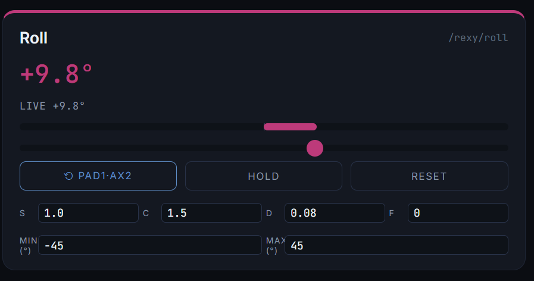
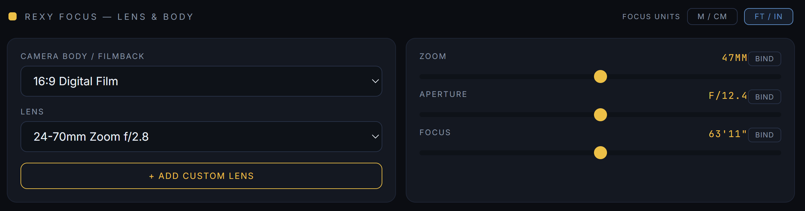
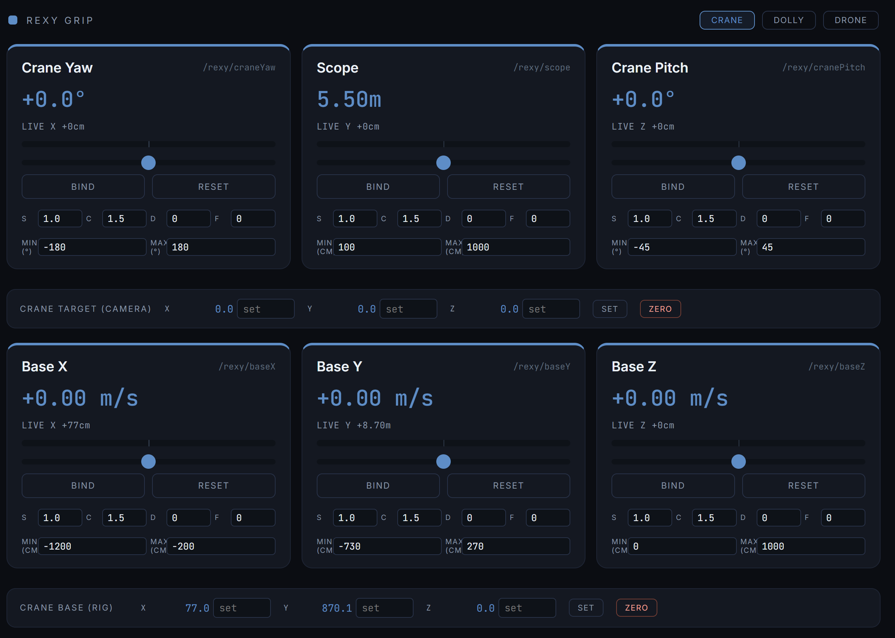
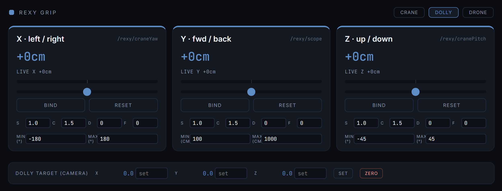
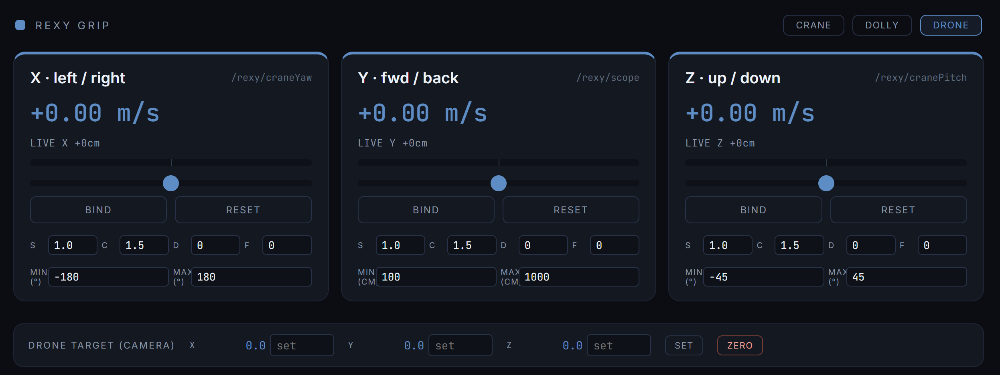
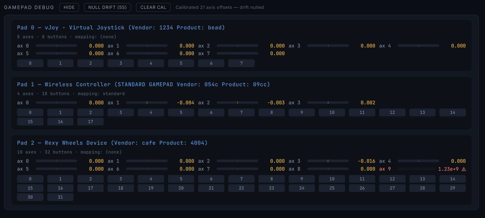

# Rexy Bridge

Virtual production camera control for Unreal Engine 5. Drive Cine Camera Actors and CameraRig_Crane rigs live in the editor using physical wheels, game controllers, or keyboard.


## What it does

- **Live camera head control** — pan, tilt, roll with a real fluid-head feel (response curve, sensitivity, deadband, feather per axis)
- **Crane rig control** — yaw, pitch, scope (arm length), and base X/Y/Z position
- **Drone / dolly modes** — velocity-based free-fly, or absolute positioning, switchable at runtime
- **Continuous wheels mode** — pan/tilt/roll as infinite-rotation velocity controls (fluid-head style)
- **Per-camera bindings** — each camera in your scene keeps its own input bindings; switch cameras with a button press
- **Custom lenses** — define focal range, aperture, focus distance; UE camera's LensSettings update live (focus goes to infinity)
- **Multiple inputs** — Rexy Wheels, PS4/Xbox controllers, keyboard, all bindable side-by-side
- **Autolevel function** — bindable button that smoothly returns roll to 0° over a configurable time
- **Live readouts** — see the camera's actual rotation/position alongside what your input is commanding
- **Imperial / metric units** — switch globally, plus a separate toggle for focus distance (focus pullers traditionally use ft/in)
- **Auto-invert on bind** — push the stick in the direction you want to be "positive" first; binding figures out the inversion automatically
- **Stick drift calibration** — 5-second null-drift capture nulls residual offsets from worn sticks


## Hardware support

| Device | Status |
|---|---|
| Rexy Wheels | Primary supported hardware |
| PS4 controller | Supported (sticks need null-drift calibration after movement) |
| Xbox controller | Should work (untested) |
| Keyboard | Supported |
| Generic HID gamepads | Supported via browser Gamepad API |

## Requirements

- **Python 3.10+**
- **Unreal Engine 5.3+** with the Remote Control plugin enabled
- A modern browser — Chrome / Edge / Firefox recommended (Safari Gamepad API support is partial)

## Quick start

### 1. Install Python dependencies

```bash
pip install -r requirements.txt
```

### 2. Set up Unreal Engine

See [`docs/ue5-setup.md`](docs/ue5-setup.md) for step-by-step instructions covering:
- Enabling the Remote Control plugin
- Creating the `RexyControl` preset
- Exposing camera properties so multi-camera discovery works
- Finding your camera and crane object paths

### 3. Configure mappings

```bash
cp mappings.json.example bridge/mappings.json
```

Edit `bridge/mappings.json` and replace the `<YOUR_PROJECT>` / `<YOUR_LEVEL>` / `<YOUR_CAMERA>` placeholders with the actual paths from your UE5 project. The UE5 setup guide walks you through finding these.

### 4. Run the bridge

**Windows:**
```powershell
cd bridge
python rexy_osc.py --verbose
```

**Mac / Linux:**
```bash
cd bridge
python3 rexy_osc.py --verbose
```

### 5. Open the app

Open `app/index.html` in your browser. It auto-connects to the bridge at `ws://127.0.0.1:9000`. When everything is up you'll see three green indicators in the top right:


### 6. Bind your hardware

- Click **Bind** on any parameter card.
- For axis bindings (wheels/sticks), push in the direction you want to be "positive" *first* — the binding auto-inverts to match.
- For keyboard, press the increase key, then the decrease key.



## How it works

Three components, OSC as the contract:

```
[Hardware] → [Browser app] → WebSocket → [Bridge (Python)] → Remote Control → [UE5]
```

- The **bridge** maintains a WebSocket server (port 9000) for the app and a connection to UE5's Remote Control WebSocket API (port 30020).
- The **browser app** reads hardware via the Gamepad API, applies per-axis tuning (curve, sensitivity, deadband, feather), and sends OSC-style messages to the bridge.
- The bridge translates these into Remote Control property writes against the actor properties defined in `mappings.json`.

OSC is the stable contract layer. Today inputs come from the browser; tomorrow they could come from a Pi Pico over WiFi — the bridge doesn't care where OSC originates.

## Controls reference

### Camera head — Rexy Wheels

Pan / tilt / roll with the per-axis tuning row visible. Each card has its own S/C/D/F values, Min/Max range, and Bind / Hold / Reset buttons. The mode selector top-right switches between **Absolute** (slider = exact rotation) and **Continuous** (slider = rotation rate, infinite range).


### Focus, lens & body — Rexy Focus

Filmback selector, lens preset / custom lens, and the three continuous controls (zoom mm, aperture f/, focus). Focus is log-scaled across 30 cm to ∞. The top-right **Focus units** toggle lets you keep focus in ft/in even when everything else is metric — useful for focus pullers.



### Grip modes — Rexy Grip

Three modes, switched at runtime:

**Crane** — drive the CameraRig_Crane's yaw, pitch, and arm length. Base X/Y/Z controls below give world-space positioning of the rig.



**Dolly** — drive the camera's local X/Y/Z position directly. The crane is parked. Distances in cm (or ft if imperial).



**Drone** — camera-local *velocity* control (X = sideways, Y = forward/back, Z = up/down). Slider centre = stationary; deflection = direction and speed. Readouts in m/s (or ft/s).



### Per-card tuning

| Letter | Name | Meaning | Default |
|---|---|---|---|
| **S** | Sensitivity | Linear multiplier on input rate | 1.0 |
| **C** | Curve | Response gamma for axis inputs. 1.0 = linear; 1.5 = fluid-head feel; 2.0+ = strong gamma | 1.5 |
| **D** | Deadband | Raw input below this is treated as zero | 0 |
| **F** | Feather | Low-pass filter on the input rate. 0 = instant; 1 = very smooth ramp-in/out | 0 |

### Functions

Bindable one-shot actions, below the wheels. Currently:

- **Autolevel Roll** — smoothly returns the camera roll to 0° over `Time` seconds with `F` easing. Works in both absolute and continuous modes; in continuous mode it reads the camera's actual roll from UE and animates the absolute angle.

### Per-axis buttons

| Button | Behaviour |
|---|---|
| **Bind** | Click then actuate any input (key / stick / button) to bind. Right-click to clear. |
| **Hold** | Wheel cards only. Freezes the binding for that axis until pressed again. Slider is still draggable. |
| **Reset** | Velocity axes: halts the velocity. Absolute axes: clears the calibrated offset and snaps the slider to centre, sending the camera to absolute 0. |

### Min / Max per param

Each card has Min/Max inputs that override the default range. Honour the units toggle:
- Angles: degrees
- Distances: cm or ft (depending on units toggle; focus has its own toggle)
- Focal length: mm
- Aperture: f-stop

Changing Min/Max sends the new range to the bridge live.

## Troubleshooting

### Bridge can't connect to UE5

- Confirm the **Remote Control** plugin is enabled (Project Settings → Plugins).
- Confirm the WebSocket server is enabled (Project Settings → Plugins → Remote Control → WebSocket Server).
- Verify the port (default 30020) matches `ws_port` in `mappings.json`.
- Make sure UE5 is actually running with your project loaded.

### Hardware isn't detected by the browser

- Click anywhere on the page first — browsers require a user gesture before exposing gamepads.
- Open the **Gamepad Debug** panel at the bottom of the page. If your device doesn't appear there, it's a driver/HID issue not a Rexy Bridge issue.
- Some gamepads only appear after they've been "seen" by another app first (e.g., Steam).



The debug panel above shows three devices simultaneously — a vJoy virtual driver, a PS4 controller (with calibrated drift offsets), and a Rexy Wheels Device (axis 9 flagged red as out-of-spec; it's ignored at runtime, pending a firmware fix).

### Stick drift causing constant slow camera motion

- Open **Gamepad Debug → Null Drift (5s)**. Don't touch the sticks for 5 seconds.
- After calibration, rest-position offsets are subtracted from raw axis values.
- PS4 sticks have a *residual* offset after being moved (they don't return cleanly to zero). For those, bump the per-param **D** to 0.05–0.08 on the affected param.

### Camera goes invisible while moving the crane

- Make sure your `mappings.json` has `"access": "WRITE_TRANSACTION_ACCESS"` and `"write_throttle_ms": 100` on the crane params (craneYaw / cranePitch / scope). The example file already has this.
- If problems persist, try lower throttling: `"write_throttle_ms": 200`.

### "Auto pan/tilt OFF" message at startup

- This is correct. The legacy hard-coded pan/tilt path is OFF by default. Bind your wheels via the app's Bind UI — multiple devices supported, per-camera bindings.
- Pass `--auto-pan-tilt` to re-enable the legacy behaviour for a quick test.

## Known limitations

- **Per-camera lens settings** don't currently persist when switching cameras — re-select the lens from the dropdown after switching.
- **Min/Max in dolly mode** still shows crane-mode defaults in the inputs even though the operating range is ±500 cm. Display only; bridge writes correctly.
- **Rexy Wheels firmware** has a phantom value on axis 9 (~1.2e9). Filtered in software — will be fixed in firmware.
- **Safari** Gamepad API has partial support; Chrome/Firefox/Edge are recommended.

## Credits

Original concept and Mac-side development: **Robert Bevis**
Windows port, feature expansion, GitHub release: **Robert Portazier**

Built with Python, [websockets](https://websockets.readthedocs.io/), [python-osc](https://pypi.org/project/python-osc/), [pygame](https://www.pygame.org/), and the UE5 Remote Control plugin.

## License

MIT. See [LICENSE](LICENSE).
