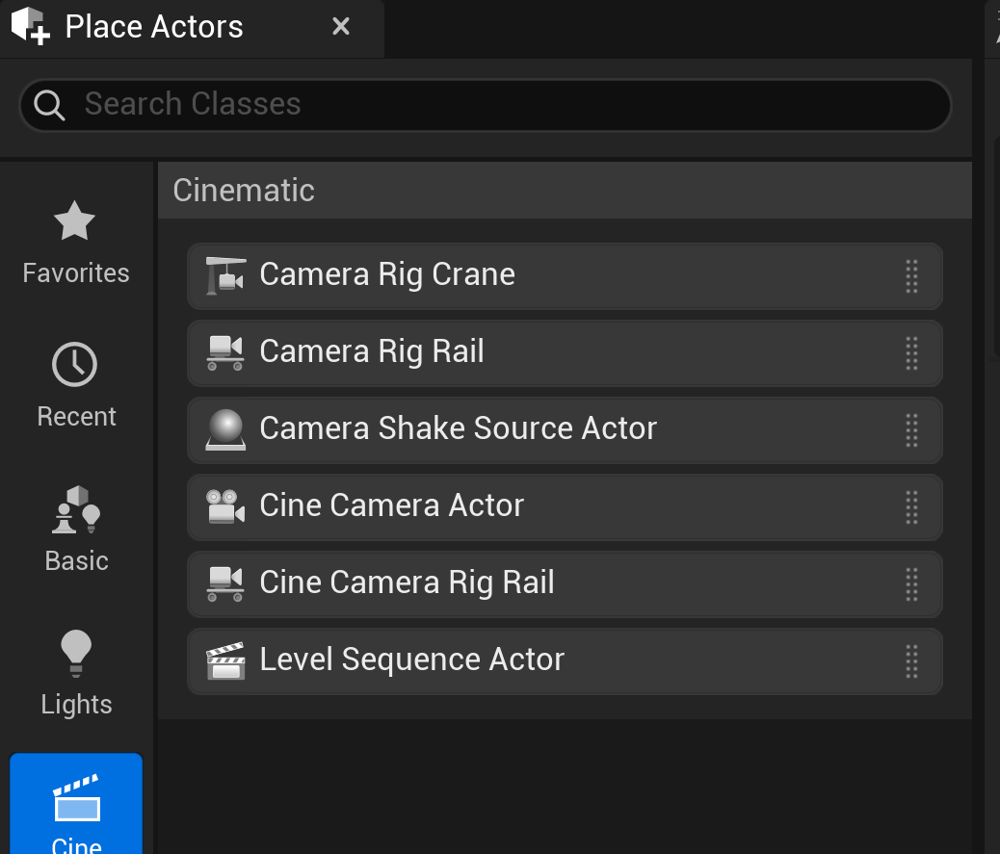
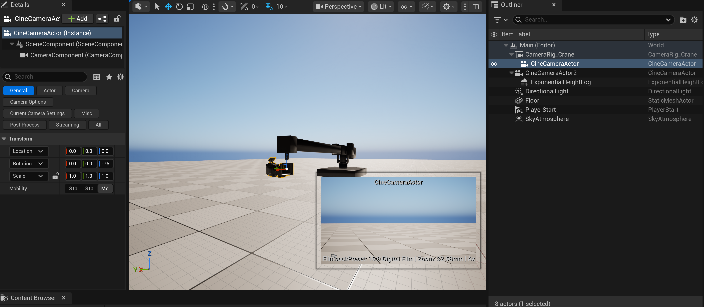
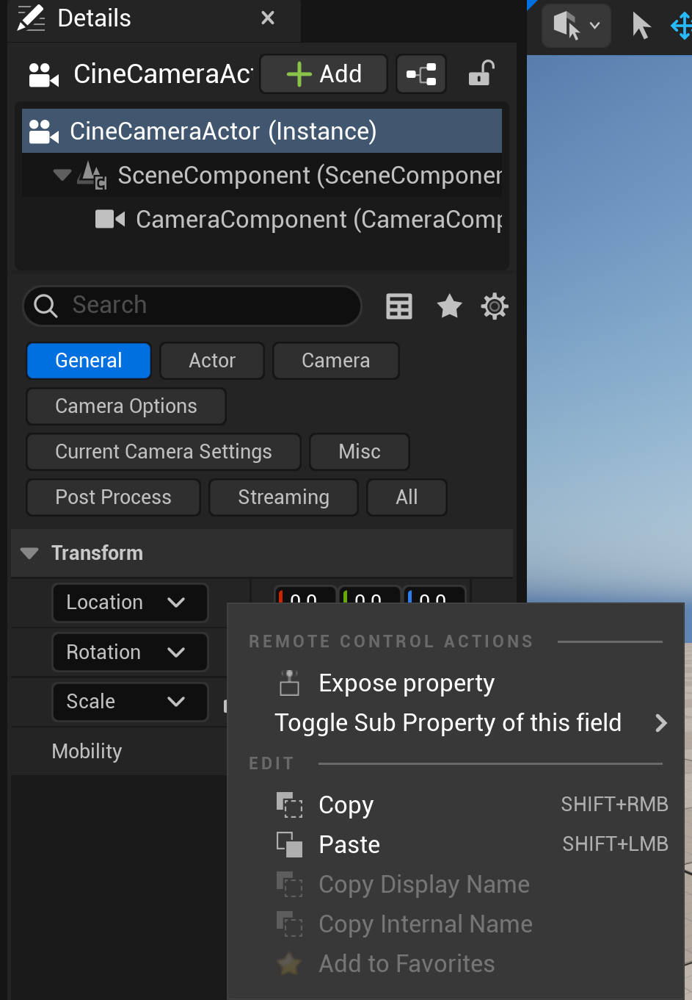
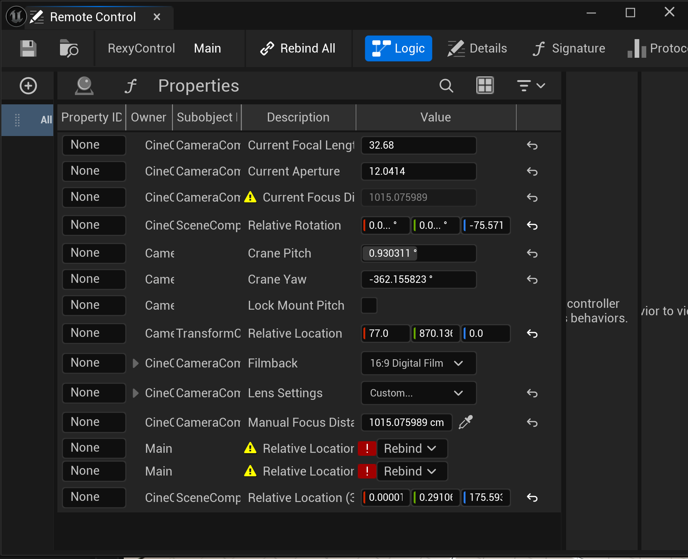

# UE5 Setup Guide

This is the part most people get stuck on. Take it step by step. Once you've done it once for one project, you'll fly through it for the next.

## 1. Enable the Remote Control plugin

1. Open your project in UE5.
2. **Edit → Plugins**.
3. Search for **Remote Control**.
4. Tick the **Remote Control API** plugin checkbox.
5. Tick the **Remote Control Web Interface** plugin if available (optional, but useful for testing).
6. Restart UE5 when prompted.

## 2. Enable the Remote Control WebSocket server

Rexy Bridge talks to UE over WebSocket (not HTTP). You need to confirm the WS server is running.

1. **Project Settings → Plugins → Remote Control**.
2. Verify **WebSocket Server Port** is `30020` (the default).
3. Confirm **WebSocket Server Bind Address** is `0.0.0.0` or `127.0.0.1` (default).
4. Save and restart if anything changed.

You can test the server is up by visiting `http://127.0.0.1:30010` in your browser (the HTTP server, not WS, but it confirms the plugin is active).

## 3. Add your cinematic actors

If you're starting from scratch, the actors you'll typically want are under **Place Actors → Cinematic**:



- **Camera Rig Crane** — the rig you'll drive with Crane mode.
- **Cine Camera Actor** — the camera you'll attach to the crane (or use free).

Drop these into your scene and attach the cine camera to the crane (drag it onto the crane in the World Outliner; UE will offer the `CameraMount` socket).

A typical resulting scene looks like this — note the World Outliner hierarchy with `CineCameraActor` parented under `CameraRig_Crane`:



## 4. Create the RexyControl preset

The bridge uses a Remote Control preset called `RexyControl` to discover cameras automatically.

1. **Window → Remote Control → Remote Control Presets** (or Content Browser → right-click → **Remote Control → Remote Control Preset**).
2. Create a new preset and name it exactly **`RexyControl`** (case-sensitive).
3. Save it somewhere convenient like `Content/RemoteControl/RexyControl`.
4. Double-click to open it.

## 5. Expose properties so Rexy Bridge can find your cameras and crane

Rexy Bridge discovers cameras by looking at which actors the `RexyControl` preset has properties exposed on. So for each `CineCameraActor` you want to control:

1. Select the camera actor in your level.
2. In the **Details panel**, find any property (the simplest is `Current Focal Length` under the camera component).
3. Right-click the property → **Expose property** (from the Remote Control Actions context menu):

   

4. Choose the `RexyControl` preset when prompted.
5. Repeat for each camera you want available in Rexy Bridge.

For the **crane** rig, do the same — expose at least one property on the `CameraRig_Crane` actor (e.g. `CraneYaw`) to the same `RexyControl` preset.

Once configured, your preset's **Properties** panel should look something like this — with entries for the camera (focal length, aperture, rotation, focus distance) and the crane (yaw, pitch, transform):



You don't need to expose every property Rexy Bridge controls — just one per actor so the bridge can find them. The bridge then walks each camera's `SceneComponent` and `CameraComponent` directly for the actual control writes.

If you only have one camera and don't care about multi-cam, you can skip this — the bridge will still work, it just won't be able to switch between cameras from the app.

## 6. Set up your crane (optional)

If you want the Grip section to work with a CameraRig_Crane actor:

1. Add a `CameraRig_Crane` actor (see step 3 above).
2. Attach your camera to it: drag the camera onto the crane in the World Outliner, or set the camera's **Parent Actor** to the crane.
3. Make sure the camera's Attach Socket is `CameraMount` (the crane's mount socket).

The bridge auto-detects the crane attachment when you select a camera in the app — the Crane mode button will be enabled if the camera is on a crane.

## Finding your paths

Your `mappings.json` needs the full object paths to your specific actors. Here's how to find them.

### Method 1: From the URL of an exposed property

1. With your `RexyControl` preset open, click an exposed property.
2. Right-click → **Copy Path**.
3. The clipboard now contains something like:
   ```
   /Game/VprodProject/Maps/Main.Main:PersistentLevel.CineCameraActor_1.CameraComponent
   ```
4. From that one path you can derive everything Rexy Bridge needs:
   - Camera SceneComponent (for pan/tilt/roll): replace `.CameraComponent` with `.SceneComponent`
   - Crane (if attached): the same prefix but with your crane actor name at the end, e.g. `.CameraRig_Crane_1`
   - Crane TransformComponent (for base XYZ): crane path + `.TransformComponent`

### Method 2: Run the bridge with --verbose

1. Edit `mappings.json` with your best guess at the paths.
2. Run the bridge with `--verbose`.
3. In the app, click **Rescan** in the camera row.
4. The bridge logs every discovered camera to the PowerShell / Terminal window. Copy those paths into `mappings.json`.

### Method 3: Use the example file

Look at `mappings.json.example` in this repo. The structure of the paths follows a predictable pattern:

```
/Game/<YOUR_PROJECT>/Maps/<YOUR_LEVEL>.<YOUR_LEVEL>:PersistentLevel.<YOUR_ACTOR>[.<YOUR_COMPONENT>]
```

| Placeholder | What it is | Example |
|---|---|---|
| `<YOUR_PROJECT>` | Top-level folder under `Content/` | `VprodProject` |
| `<YOUR_LEVEL>` | Your level / map name | `Main` |
| `<YOUR_ACTOR>` | The actor as named in the World Outliner | `CineCameraActor_1` |
| `<YOUR_COMPONENT>` | The component on that actor | `SceneComponent`, `CameraComponent`, `TransformComponent` |

Find your actor names in the **World Outliner** in UE5. Find your project / level names by looking at the title bar of the editor.

## Testing the connection

1. Start the bridge: `python rexy_osc.py --verbose` (Windows) or `python3 rexy_osc.py --verbose` (Mac/Linux).
2. Open `app/index.html` in your browser.
3. You should see in the top-right of the app:
   - **HARDWARE LIVE** (or your device name) — green dot
   - **WS CONNECTED** — green dot
   - **UE RC CONNECTED** — green dot
4. In the camera row, click **Rescan**. Cameras that have at least one exposed property in `RexyControl` should appear as buttons.
5. Click a camera → drag the pan slider in the app → camera should rotate in UE5 in real time.

If any of the three dots are red:

- **HARDWARE OFFLINE** — your gamepad/wheels aren't detected. Click anywhere on the page first; some browsers wait for a user gesture.
- **WS OFFLINE** — the Python bridge isn't running or the WS port (default 9000) is busy.
- **UE RC OFFLINE** — the Remote Control plugin isn't running, or the port is wrong, or your project isn't open.

## Common gotchas

- **Preset name is case-sensitive.** It MUST be `RexyControl` exactly.
- **Editor only, not Play mode.** The bridge writes properties via Remote Control, which works live in the editor without entering PIE.
- **Modifying `mappings.json` requires a bridge restart.** The file is read once at startup. Ctrl+C the bridge and restart it after edits.
- **Crane visibility flickers** if `crane_rerun_construction` is `true`. Default is `false`. Only flip it on if you're debugging crane mesh issues.
